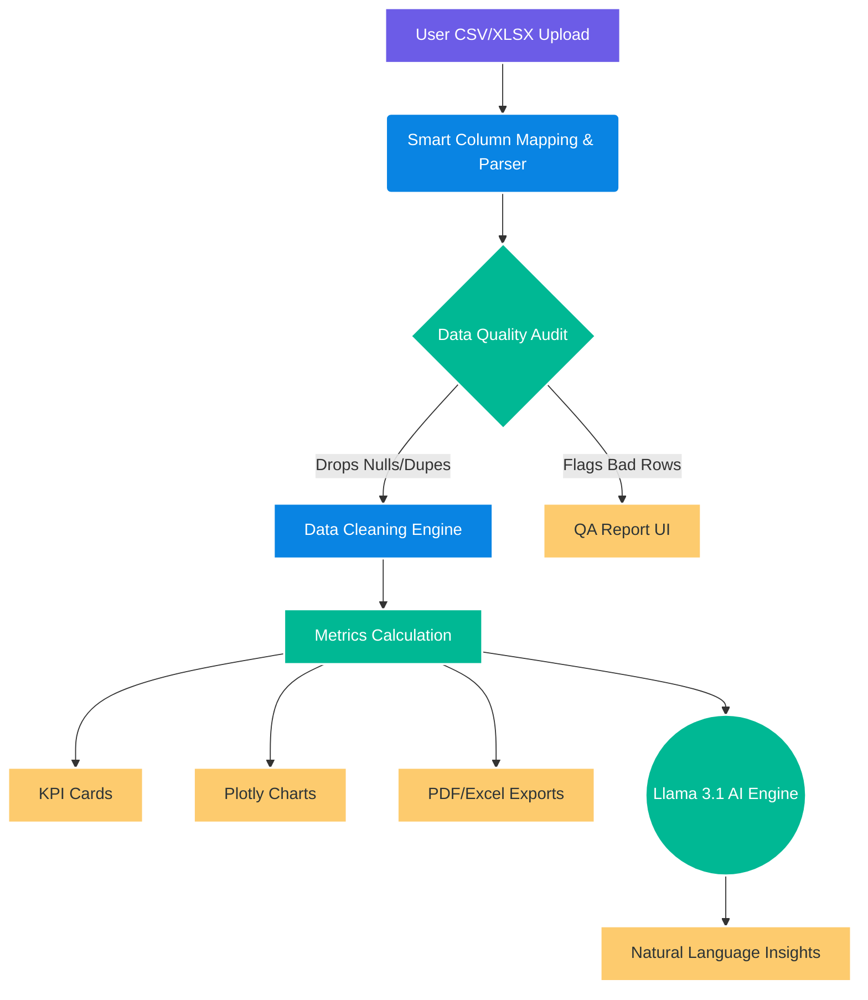
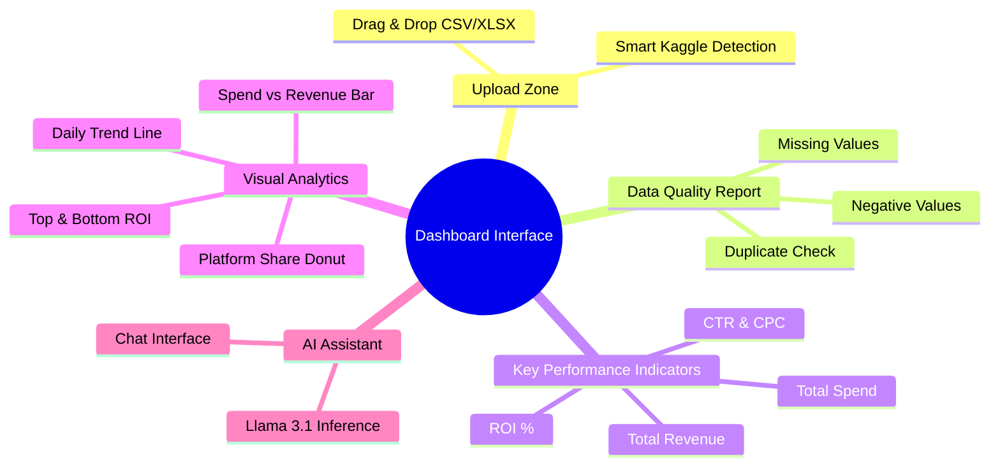

<div align="center">
  
# 🚀 Campaign Performance & Reporting Dashboard

**An End-to-End Digital Marketing Analytics Engine with Automated QA & AI Insights**

[](https://campaign-performance-iq.streamlit.app)
[](https://www.python.org/)
[](https://pandas.pydata.org/)
[](https://plotly.com/)
[](https://groq.com/)

[**Live Interactive Demo**](https://campaign-performance-iq.streamlit.app) 🌟

</div>

---

## ✨ Why this Dashboard?

This is not just another data visualizer. This is a **production-grade marketing analytics engine**. It comes equipped with:
*   🛡️ **Automated Data Quality Audit** 
*   🧠 **Smart Auto Column Mapping** (perfect for Kaggle datasets!)
*   📈 **Mathematical Weighted Aggregations**
*   🤖 **Grounded AI Insights Assistant** (0% Hallucination)
*   📑 **Excel & PDF Export Engines**

---

## 🗺️ System Architecture & Pipeline



---

## 🎨 Visual Interface Walkthrough



---

## 🧠 Smart Auto Column Mapping (NEW!)

Tired of manually renaming columns when you download data from Kaggle or Meta Ads? The dashboard now includes a **Fuzzy Match Engine** that automatically detects and renames over **50+ column variations**.

| Dataset Format | Dashboard Automatically Detects As |
| :--- | :--- |
| `Acquisition_Cost`, `Amount_Spent`, `Budget` | ➡️ **Spend** |
| `Channels_Used`, `ad_network` | ➡️ **Platform** |
| `Total_Revenue`, `Conversion_Value` | ➡️ **Revenue** |
| `Leads`, `Installs`, `Registrations` | ➡️ **Conversions** |
| `Campaign_Type`, `ad_group` | ➡️ **Campaign Name** |

---

## 🧮 Core Marketing Metrics

All ratio metrics rely on **weighted mathematical sums**, preventing common aggregation errors like "averaging percentages."

$$CTR (\%) = \left( \frac{\sum \text{Clicks}}{\sum \text{Impressions}} \right) \times 100$$
$$CPC = \frac{\sum \text{Spend}}{\sum \text{Clicks}}$$
$$CPM = \left( \frac{\sum \text{Spend}}{\sum \text{Impressions}} \right) \times 1000$$
$$ROI (\%) = \left( \frac{\sum \text{Revenue} - \sum \text{Spend}}{\sum \text{Spend}} \right) \times 100$$

> 🛡️ **Divide-by-Zero Safety:** All calculations execute via `utils.metrics.safe_divide()`, ensuring clean `0.0` output rather than runtime crashes.

---

## 🤖 Grounded AI Insights Assistant

The integrated **AI Analyst** allows users to ask natural-language questions about their campaign performance:

- *"Which campaign gave the highest return on ad spend?"*
- *"Why is ROI negative on Twitter?"*
- *"Summarize this month's top performing channels."*

**Zero Hallucination System:** Raw user rows are never sent to external APIs; only aggregated statistics (1.8KB compact context) are transmitted to Groq's `llama-3.1-8b-instant`.

---

## 💻 Tech Stack & Dependencies

<p align="center">
  
  
  
  
</p>

---

## 🚀 Quickstart & Local Setup

```bash
# 1. Clone the repository
git clone https://github.com/ajay160380/Campaign-Performance-Reporting-Dashboard.git
cd Campaign-Performance-Reporting-Dashboard

# 2. Create a virtual environment (optional but recommended)
python3 -m venv venv
source venv/bin/activate  # On Windows: venv\Scripts\activate

# 3. Install requirements
pip install -r requirements.txt

# 4. Set Groq API Key (Optional, for AI Assistant)
export GROQ_API_KEY="your_groq_api_key_here"

# 5. Launch local application
streamlit run app.py
```
> The application will launch at `http://localhost:8501`.

---

<div align="center">
  <p>Crafted with ❤️ by <a href="https://github.com/ajay160380">Ajay Vishwakarma</a></p>
  
</div>
